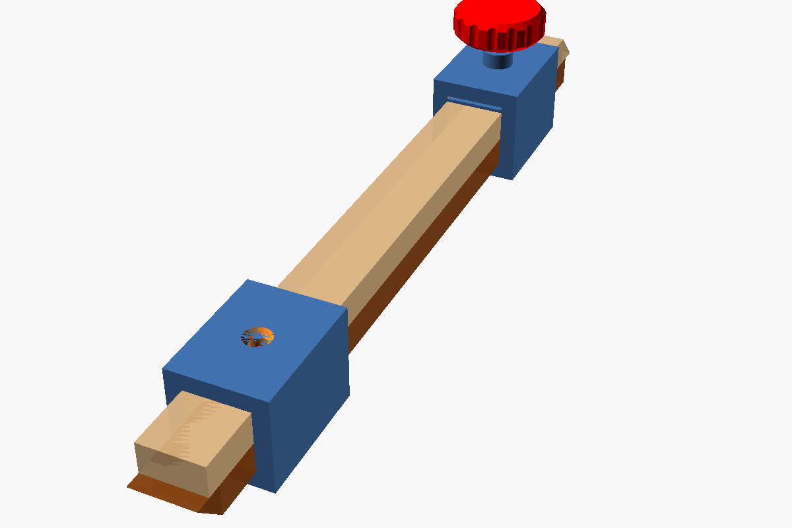
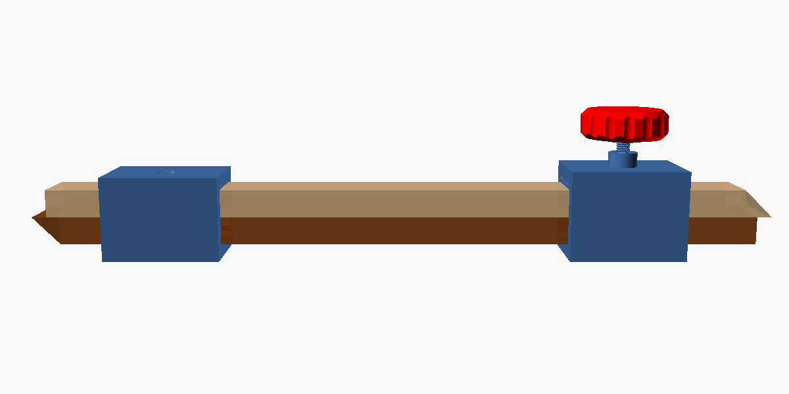
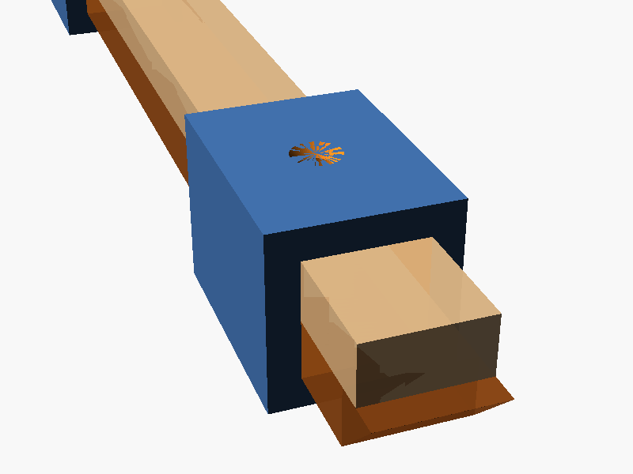
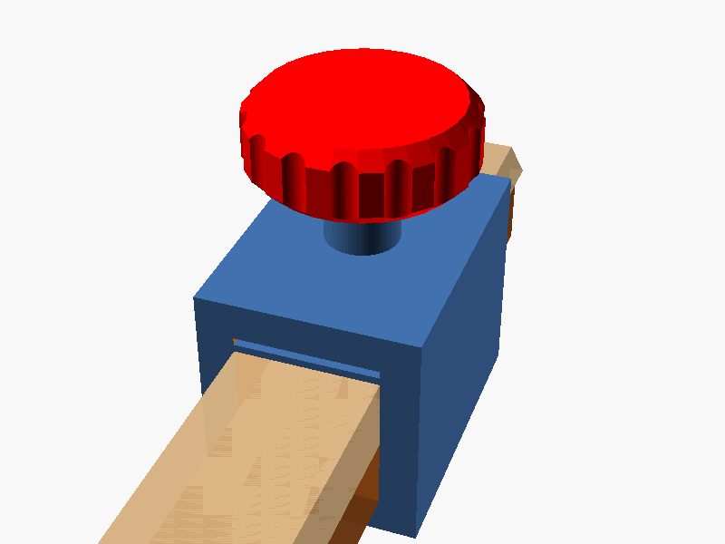
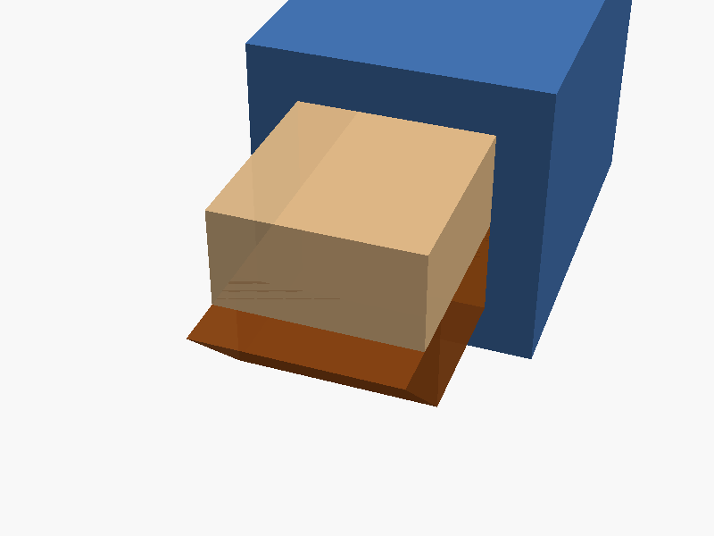
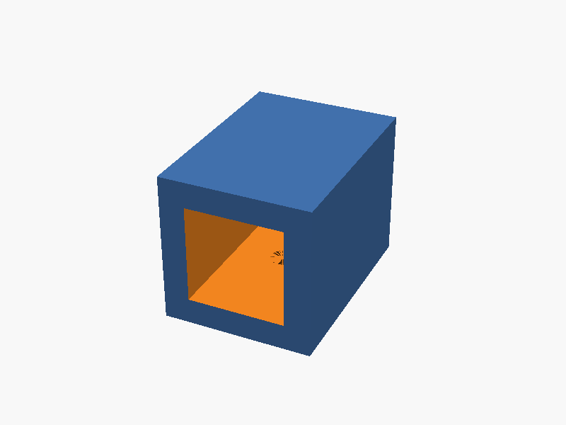
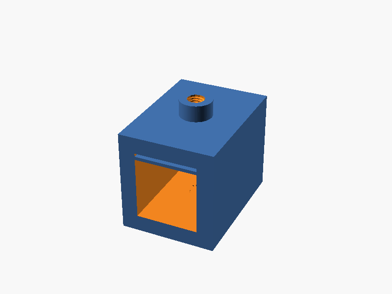
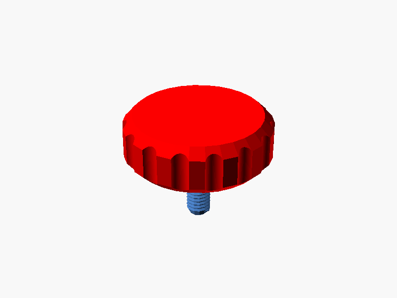

# OpenSCAD Pinch Rods

A parametric 3D-printable pinch rod tool for checking furniture carcases and boxes for square, and transferring interior dimensions without measuring.



## What are pinch rods?

Pinch rods are a traditional woodworking measuring tool. Two flat rods overlap and slide through a pair of guides. Place the pointed ends in opposite diagonal corners of a box or cabinet - if both diagonals match, the assembly is square.

They are also used to transfer interior dimensions directly to a workpiece without reading a number off a tape measure.



## How it works

- **Guide 1** (near end) is mounted inverted. Its screw secures it to the top rod.
- **Guide 2** (far end) has a threaded standoff and a clamping membrane. The thumbscrew locks the bottom rod.
- Each guide locks a different rod, so the total span is set in two independent steps.
- Both rods taper to a 45-degree chisel point at opposite ends, seating snugly into corners.

| Guide 1 - inverted, screw on top | Guide 2 - thumbscrew knob |
|---|---|
|  |  |

### Tapered tips

Both rods have a 45-degree chisel taper at opposite ends, pointing toward the shared centreline between the two stacked rods so they seat cleanly into square corners.



## Dependencies

The SCAD file requires two OpenSCAD libraries installed in your libraries folder:

- [BOSL2](https://github.com/BelfrySCAD/BOSL2) - for threaded screws and screw holes
- [parametric-knob-maker](https://github.com/TemptorSent/parametric-knob-maker) - for the thumbscrew knob

## Usage

Open `pinch_rods.scad` in OpenSCAD and set the two variables at the top:

```openscad
// "assembled" - preview the full tool
// "print"     - show a single part for 3mf export
MODE = "assembled";

// Which part to export when MODE = "print":
// "fastner"  "guide1"  "guide2"
PRINT_PART = "guide2";
```

## Printable parts

Three parts are printed separately. Export each as a `.3mf` by setting `MODE = "print"` and selecting the part with `PRINT_PART`.

| Guide 1 | Guide 2 | Thumbscrew knob |
|---|---|---|
|  |  |  |

> **Note:** Guide 1 is printed in its natural orientation (flat bottom on the bed) and flipped upside down when assembling.

## Key parameters

| Variable | Default | Description |
|---|---|---|
| `STOCK_THICKNESS` | `9.5 mm` | Height of one rod (two stack to fill the guide opening) |
| `STOCK_WIDTH` | `19 mm` | Width of each rod |
| `WALL_THICKNESS` | `5 mm` | Guide wall thickness |
| `GUIDE_LENGTH` | `40 mm` | Depth of each guide block |
| `ROD_PREVIEW_LENGTH` | `200 mm` | Rod length shown in assembled preview |

## References

- [Make Pinch Rods with Home Center Materials](https://blog.lostartpress.com/2013/04/03/make-pinch-rods-with-home-center-materials/) - Lost Art Press, 2013
- [Crucible Pinch Rods Available](https://blog.lostartpress.com/2020/03/16/crucible-pinch-rods-available/) - Lost Art Press, 2020
- [New Pinch Rods in Development](https://blog.lostartpress.com/2025/02/06/new-pinch-rods-in-development/) - Lost Art Press, 2025
- [Design reference notes](pinch_rods_reference.md)
